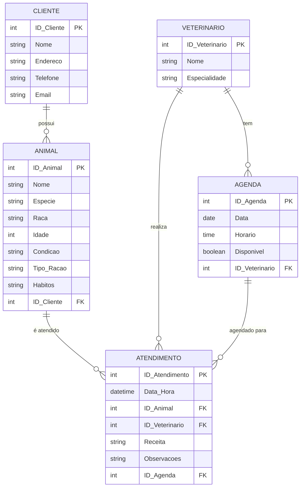

# nome_sobrenome2
meu repositorio de engenharia de software

Sistema para a clinica veterinária .....
Autor: Emiliano S. Monteiro

# 1. Descrição do sistema

Sistema para clinica veterinária...

Nome da clínica:

# 2. Diagrama do banco de dados

Colocar aqui o diagrama de banco...

# 3. Diagrama de casos de uso

Colocar aqui o diagrama de casos de uso...

# 4. Principais telas do sistema

# 5. Arquitetura do sistema

....