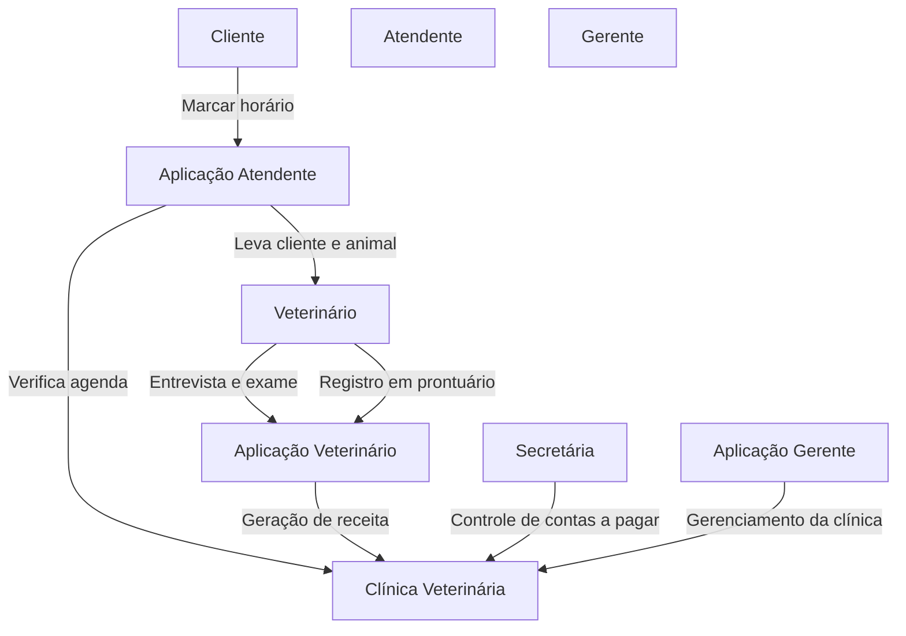
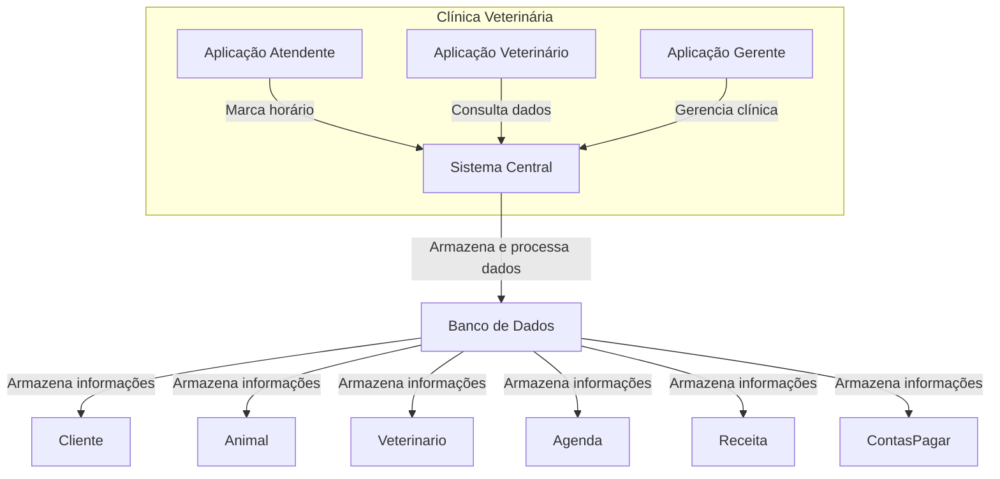
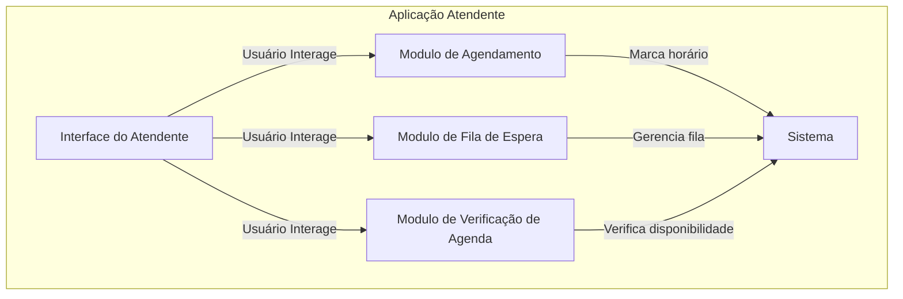

# nome_sobrenome2
meu repositorio de engenharia de software

Sistema para a clinica veterinária .....
Autor: Emiliano S. Monteiro

---
# 1. Descrição do sistema

Nome da clínica: cachorro amarelo.

1. Uma clínica veterinária atende apenas os animais: gatos e cachorros. 
2. Os clientes devem fazer um cadastro de si e dos animais. 
3. Os clientes devem informar as condições nas quais os animais chegam. 
4. Os clientes devem informar o tipo de ração que o animal come. 
5. O cliente deve informar hábitos do animal. 
6. Para cada animal é possível que mais de um veterinário o atenda. 
7. Os animais podem chegar e serem atendidos de acordo com uma agenda do dia. 
8. Cada animal atendido receberá uma ficha e um prontuário. 
9. Outros donos podem querer marcar horários de atendimento futuro. 
10. O atendimento gera uma receita para o animal. 
11. Quando um cliente chega na clínica veterinária ele é atendido por um atendente. 
12. O atendente deve verificar se existe agenda disponível com um veterinário. 
13. O atendente deve colocar o cliente e seu animal na fila de espera, se for o caso. 
14. O atendente deve levar o cliente e o animal até o veterinário. 
15. O veterinário deve realizar uma entrevista com o dono do animal. 
16. O resultado da entrevista deve ir para um formulário. 
17. O veterinário deverá examinar o animal e anotar em prontuário(ficha) suas observações. 
18. Dependendo da situação do animal este receberá uma receita.
19. A cobrança é registrada no contas a pagar.
20. A secretária é responsável pelo contas a pagar.
21. A clinica aceita vários de pagamento, como: cartão de crédito, pix e dinheiro.
22. A clinica tem animais para adoção em exposição.
22. A clinica trabalho em regime de plantão.
23. A clinica tem uma loja de produtos para cães e gatos.
24. A clinica tem um hotel para cães.

.
---
# 2. Diagrama do banco de dados

# 3. Diagrama de casos de uso

# 4. Principais telas do sistema

# 5. Arquitetura do sistema

## 5.1. System Context (C4Context)

## 5.2. Container diagram (C4Container)

## 5.3. Component diagram (C4Component)

